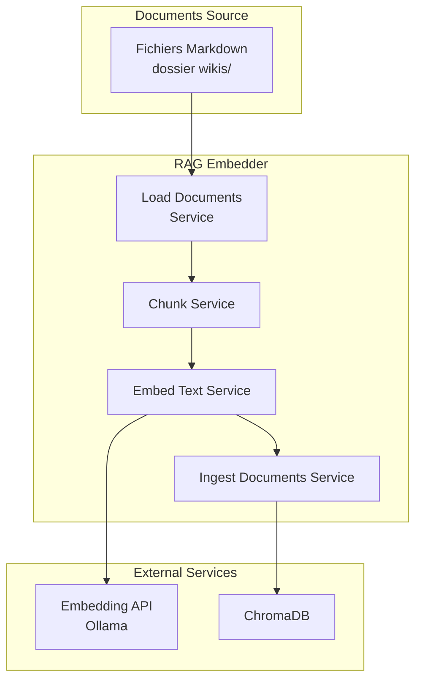
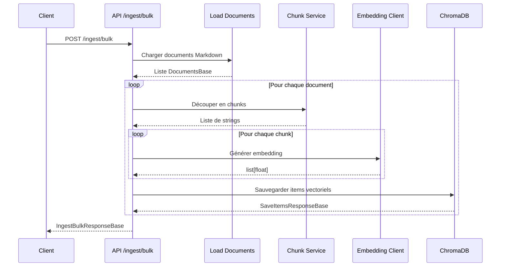

# Documentation du Micro-service RAG Embedder

## 1. Présentation Générale

### 1.1 Description

Le micro-service **rag_embedder** est un composant clé de l'architecture RAG (Retrieval-Augmented Generation). Il est responsable de la transformation de documents textuels en vecteurs sémantiques (embeddings) et de leur stockage dans une base de données vectorielle (ChromaDB).

### 1.2 Objectif

- **Chargement des documents** : Lecture des fichiers Markdown depuis le dossier `wikis/`
- **Chunking intelligent** : Découpe des documents en segments sémantiques
- **Embedding** : Génération de vecteurs numériques représentant le sens du texte
- **Stockage vectoriel** : Persistance des embeddings dans ChromaDB

---

## 2. Architecture du Service



---

## 3. Structure du Projet

```
rag_embedder/
├── app/
│   ├── main.py                 # Point d'entrée FastAPI
│   ├── api/
│   │   ├── routers/
│   │   │   └── embed_router.py  # Routes API
│   │   ├── dependencies.py     # Dépendances FastAPI
│   │   └── lifespan.py         # Gestion du cycle de vie
│   ├── services/
│   │   ├── chunk_service.py           # Découpage de texte
│   │   ├── embed_text_service.py      # Génération embeddings
│   │   ├── ingest_documents_service.py # Ingestion documents
│   │   └── load_documents_service.py  # Chargement fichiers
│   ├── dal/
│   │   ├── clients/
│   │   │   ├── embedding_client.py    # Client HTTP Ollama
│   │   │   └── retriever_client.py     # Client ChromaDB
│   │   └── files/
│   │       └── markdown_reader.py      # Lecture Markdown
│   ├── schemas/                # Modèles Pydantic
│   └── core/
│       ├── config.py           # Chargement configuration
│       └── config.json         # Configuration JSON
├── wikis/                      # Documents sources Markdown
├── dockerfile                  # Image Docker production
├── dockerfile.docs            # Image Docker documentation
├── pyproject.toml             # Dépendances Python
└── mkdocs.yml                 # Configuration MkDocs
```

---

## 4. Configuration

### 4.1 Fichier config.json

```json
{
    "embedding": {
        "provider": "ollama",
        "url": "http://ollama:11434/api/embed",
        "model": "bge-m3:567m",
        "prefixes": {
            "query": "query: ",
            "document": "document: "
        }
    },
    "chunking": {
        "size_chars": 2000,
        "overlap_chars": 400
    }
}
```

### 4.2 Paramètres de Configuration

| Paramètre | Description | Valeur par défaut |
|-----------|-------------|-------------------|
| `embedding.url` | URL de l'API d'embedding Ollama | `http://ollama:11434/api/embed` |
| `embedding.model` | Nom du modèle d'embedding | `bge-m3:567m` |
| `embedding.prefixes.query` | Préfixe pour les requêtes | `query: ` |
| `embedding.prefixes.document` | Préfixe pour les documents | `document: ` |
| `chunking.size_chars` | Taille maximale d'un chunk | `2000` caractères |
| `chunking.overlap_chars` | Chevauchement entre chunks | `400` caractères |

---

## 5. API Endpoints

### 5.1 GET `/`

Vérification de l'état de l'API.

**Réponse :**
```json
{
    "status": "ok",
    "message": "API connection successful"
}
```

---

### 5.2 POST `/embed_text`

Génère un embedding pour un texte donné.

**Corps de la requête :**
```json
{
    "text": "Votre texte ici"
}
```

**Réponse :**
```json
{
    "embeded_text": [0.123, 0.456, 0.789, ...]
}
```

---

### 5.3 POST `/ingest/bulk`

Ingest tous les documents Markdown du dossier `wikis/` dans ChromaDB.

**Corps de la requête :**
```
Aucun corps requis
```

**Réponse :**
```json
{
    "duration": "02:30",
    "savedItems": {
        "collection_count_before": 100,
        "collection_count_after": 150,
        "saved_items": [
            {
                "id": "DocumentTitle#chunk_0#path/to/file.md",
                "chunk": "Contenu du chunk...",
                "metadatas": {
                    "path": "path/to/file.md",
                    "title": "Document Title",
                    "chunk_index": 0,
                    "related_links": "linked-page.md",
                    "has_links": true
                }
            }
        ]
    }
}
```

---

## 6. Flux de Traitement

### 6.1 Ingestion de Documents



---

## 7. Services Détaillés

### 7.1 Chunk Service (`chunk_service.py`)

Le service de chunking utilise deux niveaux de découpage :

1. **Découpage par en-têtes Markdown** : Préserve la structure hiérarchique du document
2. **Découpage récursif** : Respecte les limites de caractères avec overlap

**Fonctionnalités :**
- Suppression automatique du TOC `[[_TOC_]]`
- Suppression des images Markdown ``
- Ajout de "fil d'Ariane" (breadcrumbs) pour chaque chunk

**Exemple de chunk généré :**
```
CONTEXT : Réalisation > Etape 1
CONTENT : # Réalisation
## Etape 1
Contenu de l'étape...
```

---

### 7.2 Embedding Client (`embedding_client.py`)

- Connexion à l'API Ollama pour la génération d'embeddings
- Gestion des préfixes `query:` et `document:` pour l'optimisation des requêtes
- Timeout de 120 secondes

---

### 7.3 Métadonnées des Documents

Chaque chunk stocké dans ChromaDB contient :

| Champ | Type | Description |
|-------|------|-------------|
| `id` | string | Identifiant unique `TITLE#chunk_INDEX#PATH` |
| `path` | string | Chemin du fichier source |
| `title` | string | Titre du document (décodé) |
| `chunk_index` | int | Position du chunk dans le document |
| `related_links` | string | Liens internes Markdown |
| `has_links` | bool | Présence de liens |

---

## 8. Installation et Déploiement

### 8.1 Construction de l'image Docker

```bash
# Image de production
docker build -t rag_embedder:latest .

# Image de documentation
docker build -f dockerfile.docs -t rag_embedder_docs:latest .
```

### 8.2 Variables d'Environnement

| Variable | Description | Valeur |
|----------|-------------|--------|
| `DEBUG` | Active le mode debug | `1` = activé |
| `UV_LINK_MODE` | Mode de lien uv | `copy` |
| `UV_PROJECT_ENVIRONMENT` | Chemin venv | `/opt/venv` |
| `UV_HTTP_TIMEOUT` | Timeout HTTP | `300` |

### 8.3 Ports

| Port | Service |
|------|---------|
| `8000` | API principale |
| `5678` | Debug debugpy (si DEBUG=1) |

---

## 9. Dépendances Principales

| Package | Version | Usage |
|---------|---------|-------|
| `fastapi[standard]` | ≥0.124.2 | Framework web |
| `chromadb` | ≥1.3.7 | Base de données vectorielle |
| `langchain-text-splitters` | ≥1.1.0 | Découpage de texte |
| `aiofiles` | ≥25.1.0 | Fichiers asynchrones |
| `debugpy` | ≥1.8.18 | Debug distant |

---

## 10. Utilisation avec Docker Compose

Voir le fichier `docker-compose.yml` à la racine pour la configuration complète des services.

```yaml
services:
  rag_embedder:
    build: ./rag_embedder
    ports:
      - "8000:8000"
    environment:
      - DEBUG=0
```

---

## 11. Documentation MkDocs

Le service génère sa propre documentation via MkDocs.

```bash
# Démarrer le serveur de documentation
docker build -f dockerfile.docs -t rag_embedder_docs .
docker run -p 8000:8000 rag_embedder_docs
```

---

## 12. Bonnes Pratiques

1. **Taille des chunks** : Ajuster `size_chars` selon le modèle d'embedding
2. **Overlap** : 20% de chevauchement recommandé pour la continuité sémantique
3. **Métadonnées** : Enrichir les chunks avec des informations de contexte
4. **Nettoyage** : Filtrer les éléments non-textuels (images, TOC)
