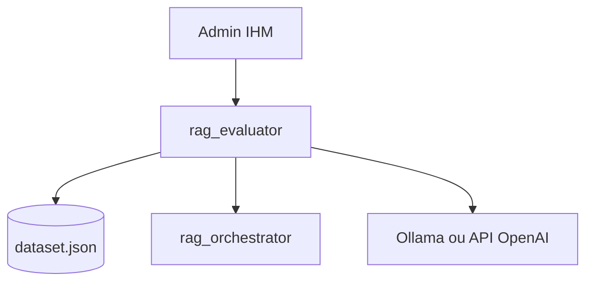
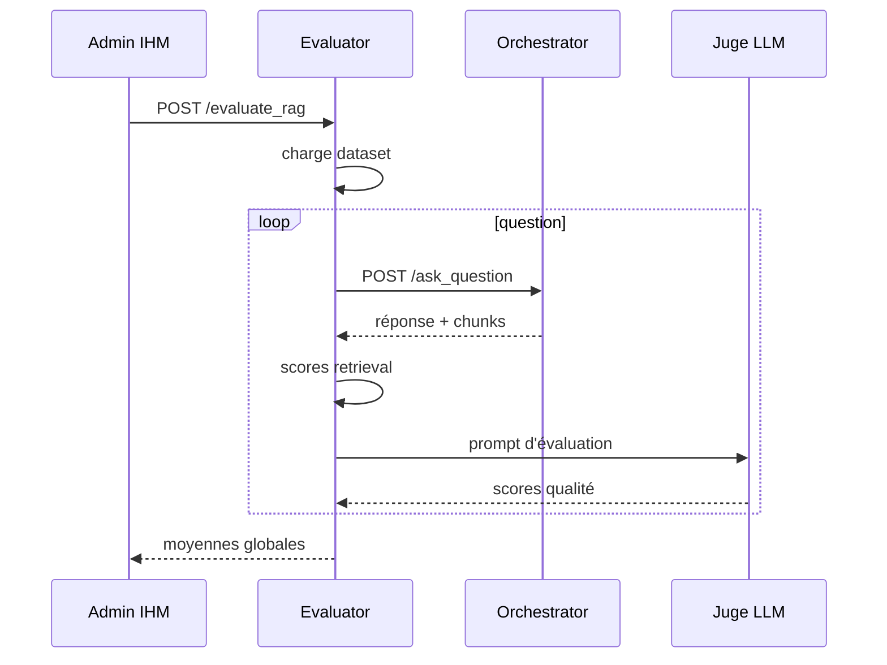

# Documentation du Micro-service RAG Evaluator

## 1. Présentation Générale

`rag_evaluator` mesure la qualité du RAG à partir d'un dataset de questions. Il interroge `rag_orchestrator`, calcule des métriques de retrieval, puis demande à un juge LLM d'évaluer la réponse générée.

## 2. Architecture du service



## 3. Structure du projet

| Dossier | Responsabilité |
|---|---|
| `app/api/routers` | Route `/evaluate_rag`. |
| `app/services` | Boucle d'évaluation, métriques de retrieval et prompt juge. |
| `app/dal/client` | Clients HTTP orchestrator et juge LLM. |
| `app/core` | Configuration, exceptions, logs, métriques et traces. |
| `dataset.json` | Dataset d'évaluation monté en lecture seule dans Docker. |

## 4. Configuration

| Paramètre | Description | Valeur actuelle |
|---|---|---|
| `llm.provider` | Fournisseur juge local. | `ollama` |
| `llm.url_provider` | Base URL Ollama. | `http://ollama:11434` |
| `llm.model` | Modèle juge local. | `qwen2.5:3b` |
| `llm.timeout_seconds` | Timeout juge. | `360` |
| `evaluation_method.use_api_openai` | Utilise l'API externe pour le juge. | `true` |

Variable importante : `DATASET_PATH=/app/data/dataset.json`.

## 5. API Endpoints

| Méthode | Route | Rôle |
|---|---|---|
| `GET` | `/` | Healthcheck minimal. |
| `POST` | `/evaluate_rag` | Lance l'évaluation complète du dataset. |
| `GET` | `/metrics` | Métriques Prometheus. |

`POST /evaluate_rag` ne nécessite pas de body.

## 6. Dataset et métriques

Chaque entrée du dataset contient au minimum une `question`, des `keywords` et une `reference_answer`.

Métriques de retrieval : MRR, nDCG, recall, precision.

Métriques de qualité : accuracy, completeness, relevance.

## 7. Flux de traitement



## 8. Observabilité et erreurs

| Signal | Description |
|---|---|
| `evaluator_requests_total` | Évaluations lancées par statut. |
| `evaluator_errors_total` | Erreurs par opération et type. |
| `evaluator_duration_seconds` | Durée totale des évaluations. |
| `evaluator_external_call_duration_seconds` | Latence orchestrator et juge. |
| `evaluator_questions_total` | Questions traitées par statut. |
| `evaluator_score` | Derniers scores moyens exposés en gauges. |

Exceptions custom : `DatasetException`, `EvaluatorClientError`, `JudgeEvaluationException`.

## 9. Docker Compose

Le service est exposé sur le port host `8004`.

```bash
docker compose up --build rag_evaluator
```

## 10. Bonnes pratiques

- Ne pas utiliser le dataset comme source de vérité métier exhaustive.
- Surveiller séparément les échecs orchestrator et juge LLM.
- Garder les prompts et réponses complets hors des logs.
