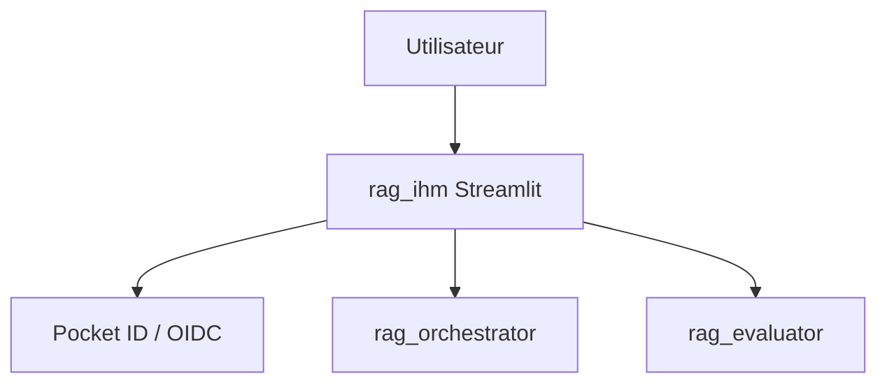
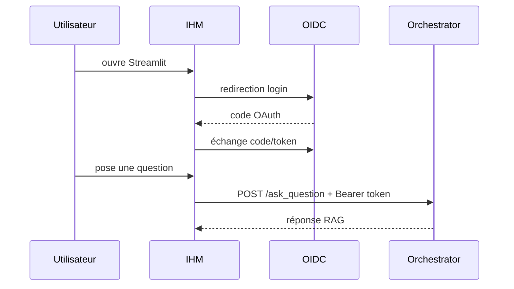

# Documentation du Micro-service RAG IHM

## 1. Présentation Générale

`rag_ihm` est l'interface Streamlit du RAG. Elle permet aux utilisateurs de poser des questions, consulter leur consommation, envoyer des feedbacks et, pour les administrateurs, lancer l'évaluation et consulter les retours.

## 2. Architecture du service



## 3. Structure du projet

| Dossier | Responsabilité |
|---|---|
| `app/pages` | Pages Streamlit : discussion, usage, feedbacks, dashboard. |
| `app/components` | Composants UI réutilisables. |
| `app/services` | Clients HTTP RAG et service OIDC. |
| `app/state` | Initialisation de `st.session_state`. |
| `app/styles` | Thème et CSS Streamlit. |

## 4. Configuration

Variables principales sans valeurs secrètes :

| Variable | Description |
|---|---|
| `RAG_ORCHESTRATOR_TEST_CONNEXION_URL` | Healthcheck orchestrator. |
| `RAG_EVALUATOR_TEST_CONNEXION_URL` | Healthcheck evaluator. |
| `RAG_ORCHESTRATOR_ASK_QUESTION_URL` | Endpoint `/ask_question`. |
| `RAG_EVALUATOR_EVALUATE_RAG_URL` | Endpoint `/evaluate_rag`. |
| `RAG_IHM_OIDC_AUTHORIZE_URL` | URL d'autorisation OIDC. |
| `RAG_IHM_OIDC_TOKEN_URL` | URL d'échange de tokens OIDC. |
| `RAG_IHM_OIDC_REDIRECT_URI` | URI de retour Streamlit. |
| `RAG_IHM_OIDC_SCOPE` | Scopes demandés. |

Les secrets OIDC ne doivent jamais être documentés ni loggés.

## 5. Interface exposée

Streamlit écoute sur le port `8501`.

Pages principales :

| Page | Rôle |
|---|---|
| Discussion | Pose de question au RAG et feedback sur réponse. |
| Consommation | Quota, tokens et préférences utilisateur. |
| Avis | Consultation admin des feedbacks. |
| Évaluation | Lancement admin de `/evaluate_rag`. |

## 6. Flux utilisateur



## 7. Erreurs et observabilité

`RagApiError` fournit des messages affichables côté UI sans exposer les détails sensibles. Les erreurs OIDC et API doivent rester courtes côté utilisateur, avec diagnostic côté services backend via Loki, Prometheus et Tempo.

## 8. Docker Compose

```bash
docker compose up --build rag_ihm
```

Le service dépend de `rag_orchestrator`, `rag_evaluator` et `pocket-id`.

## 9. Documentation MkDocs

```bash
cd rag_ihm
uv run mkdocs serve
uv run mkdocs build --strict
```

## 10. Bonnes pratiques

- Ne jamais stocker les secrets dans `st.session_state` au-delà du nécessaire.
- Ne pas afficher les détails techniques bruts aux utilisateurs.
- Préserver les clés de session existantes lors des évolutions UI.
