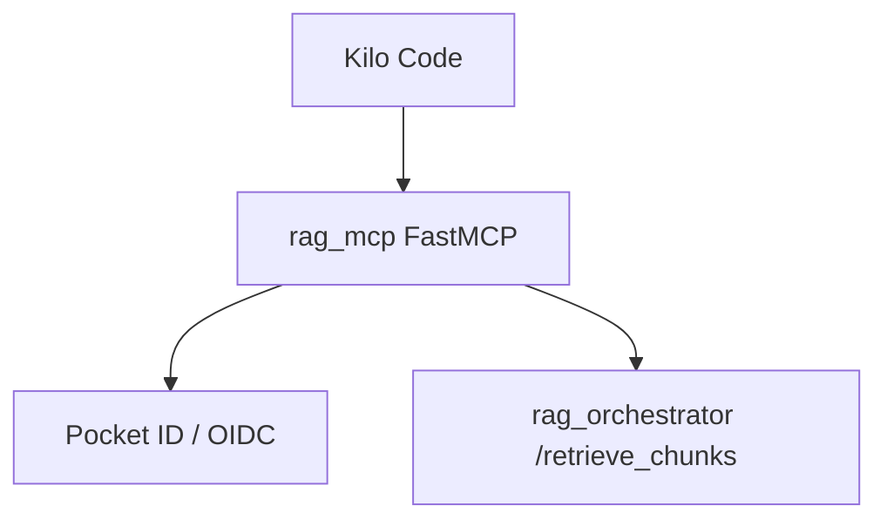
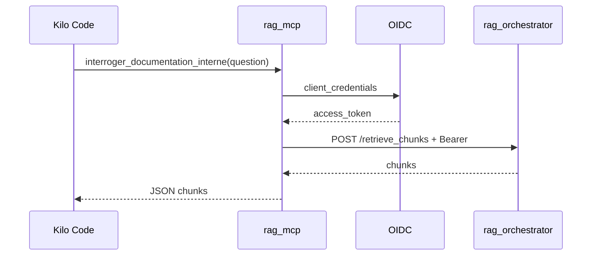

# Documentation du Micro-service RAG MCP

## 1. Présentation Générale

`rag_mcp` expose le RAG interne à Kilo Code via le protocole MCP. Il sert de pont entre l'outil `interroger_documentation_interne` et `rag_orchestrator`.

## 2. Architecture du service



## 3. Structure du projet

| Fichier | Responsabilité |
|---|---|
| `server.py` | Déclaration FastMCP et outil exposé. |
| `config.py` | Chargement des variables obligatoires. |
| `auth_client.py` | Client credentials OIDC et cache token. |
| `rag_client.py` | Appel à `rag_orchestrator` et formatage des chunks. |

## 4. Configuration

| Variable | Description |
|---|---|
| `RAG_ORCHESTRATOR_RETRIEVE_CHUNKS_URL` | Endpoint orchestrator `/retrieve_chunks`. |
| `RAG_MCP_OIDC_TOKEN_URL` | URL de token OIDC. |
| `RAG_MCP_OIDC_CLIENT_ID` | Identifiant client machine. |
| `RAG_MCP_OIDC_CLIENT_SECRET` | Secret client machine, jamais documenté en clair. |

## 5. Interface MCP exposée

Outil : `interroger_documentation_interne(question: str) -> str`.

Le retour est une chaîne JSON formatée contenant les chunks récupérés, ou un message d'erreur lisible si l'appel échoue.

## 6. Flux de traitement



## 7. Erreurs et observabilité

Le service évite d'exposer le token et le secret client. Les erreurs HTTP et réseau sont converties en messages courts pour l'appelant MCP. Les logs Docker sont collectés par Alloy/Loki via le conteneur.

## 8. Docker Compose

Le service est exposé sur le port host `8005` et écoute en SSE sur `0.0.0.0:8000`.

```bash
docker compose up --build rag_mcp
```

Point d'attention : `docker-compose.yml` référence `Dockerfile`, alors que le dépôt contient actuellement `dockerfile`.

## 9. Documentation MkDocs

```bash
cd rag_mcp
uv run mkdocs serve
uv run mkdocs build --strict
```

## 10. Bonnes pratiques

- Ne jamais logger l'access token ni le client secret.
- Garder le format de retour lisible par Kilo Code.
- Ne pas exposer le service MCP directement sur Internet sans contrôle d'accès réseau.
