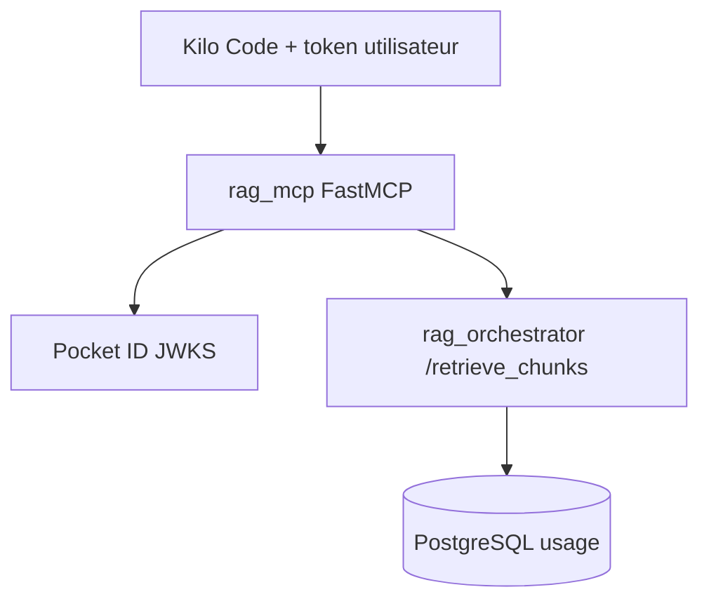
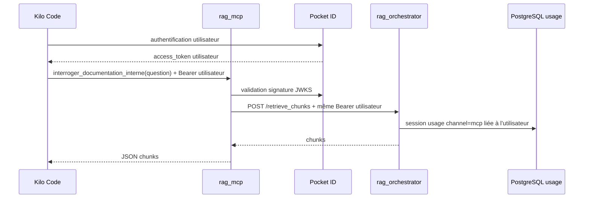

# Documentation du Micro-service RAG MCP

## 1. Présentation Générale

`rag_mcp` expose le RAG interne à Kilo Code via le protocole MCP. Il sert de pont entre l'outil `interroger_documentation_interne` et `rag_orchestrator`, en exigeant un bearer token utilisateur Pocket ID.

## 2. Architecture du service


```mermaid
flowchart TD
    Kilo[Kilo Code + token utilisateur] --> MCP[rag_mcp FastMCP]
    MCP --> OIDC[Pocket ID JWKS]
    MCP --> Orchestrator[rag_orchestrator /retrieve_chunks]
    Orchestrator --> DB[(PostgreSQL usage)]
```

## 3. Structure du projet

| Fichier | Responsabilité |
|---|---|
| `server.py` | Déclaration FastMCP et outil exposé. |
| `config.py` | Chargement des variables obligatoires. |
| `token_verifier.py` | Validation des bearer tokens utilisateur Pocket ID reçus par MCP. |
| `rag_client.py` | Appel à `rag_orchestrator` et formatage des chunks. |

## 4. Configuration

| Variable | Description |
|---|---|
| `RAG_ORCHESTRATOR_RETRIEVE_CHUNKS_URL` | Endpoint orchestrator `/retrieve_chunks`. |
| `RAG_MCP_OIDC_ISSUER` | Issuer Pocket ID attendu dans les tokens utilisateur. |
| `RAG_MCP_OIDC_JWKS_URI` | Endpoint JWKS utilisé pour valider la signature des tokens. |
| `RAG_MCP_OIDC_ALLOWED_AUDIENCES` | Audiences OIDC autorisées, typiquement le resource API Pocket ID du MCP. |
| `RAG_MCP_REQUIRED_SCOPES` | Permissions API Pocket ID obligatoires côté MCP, par exemple `rag:mcp`. |
| `RAG_MCP_RESOURCE_SERVER_URL` | URL publique du serveur MCP protégée par OAuth. |

## 5. Interface MCP exposée

Outil : `interroger_documentation_interne(question: str) -> str`.

Le retour est une chaîne JSON formatée contenant les chunks récupérés, ou un message d'erreur lisible si l'appel échoue.

## 6. Flux de traitement


```mermaid
sequenceDiagram
    participant K as Kilo Code
    participant M as rag_mcp
    participant OIDC as Pocket ID
    participant R as rag_orchestrator
    participant DB as PostgreSQL usage
    K->>OIDC: authentification utilisateur
    OIDC-->>K: access_token utilisateur
    K->>M: interroger_documentation_interne(question) + Bearer utilisateur
    M->>OIDC: validation signature JWKS
    M->>R: POST /retrieve_chunks + même Bearer utilisateur
    R->>DB: session usage channel=mcp liée à l'utilisateur
    R-->>M: chunks
    M-->>K: JSON chunks
```

## 7. Erreurs et observabilité

Le service évite de logger les tokens utilisateur. Les erreurs HTTP et réseau sont converties en messages courts pour l'appelant MCP. Les logs Docker sont collectés par Alloy/Loki via le conteneur.

## 8. Docker Compose

Le service est exposé sur le port host `8005` et écoute en Streamable HTTP sur `0.0.0.0:8000/mcp`.

```bash
docker compose up --build rag_mcp
```

Point d'attention : `docker-compose.yml` référence `Dockerfile`, alors que le dépôt contient actuellement `dockerfile`.

## 9. Documentation MkDocs

```bash
cd rag_mcp
uv run mkdocs serve
uv run mkdocs build --strict
```

## 10. Bonnes pratiques

- Ne jamais logger l'access token utilisateur.
- Garder le format de retour lisible par Kilo Code.
- Configurer Kilo avec OAuth pour que chaque développeur s'authentifie avec son compte Pocket ID.
- Déclarer une API Pocket ID dont le resource correspond à l'URL MCP annoncée, par exemple `http://localhost:8005/` en local.
- Autoriser le client OIDC Kilo/MCP à demander la permission API `rag:mcp` en accès utilisateur délégué.
- Ajouter le client OIDC Kilo/MCP dans `OIDC_ALLOWED_AUDIENCES` côté `rag_orchestrator`, sinon `/retrieve_chunks` refusera le token transmis.
