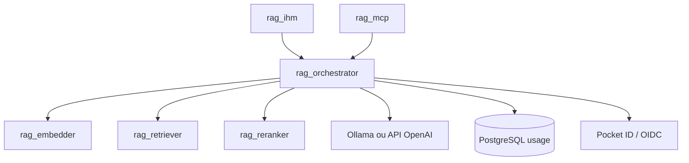
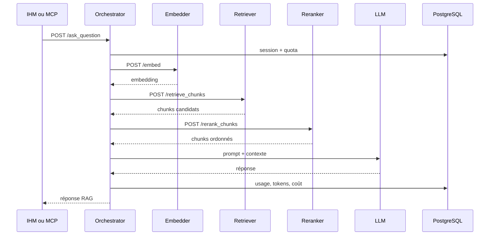

# Documentation du Micro-service RAG Orchestrator

## 1. Présentation Générale

`rag_orchestrator` coordonne le parcours RAG complet : authentification, quotas, embedding de question, recherche vectorielle, reranking, construction du prompt, appel LLM et suivi d'usage.

## 2. Architecture du service



## 3. Structure du projet

| Dossier | Responsabilité |
|---|---|
| `app/api/routers` | Routes question, auth, quotas, feedbacks et admin. |
| `app/services` | Pipeline RAG et suivi d'usage. |
| `app/dal/clients` | Clients HTTP embedder, retriever, reranker, LLM et OIDC. |
| `app/dal/repositories` | Accès PostgreSQL pour usage, quotas et feedbacks. |
| `app/core` | Configuration, exceptions, logs, métriques et traces. |
| `app/schemas` | DTO API. |

## 4. Configuration

| Paramètre | Description | Valeur actuelle |
|---|---|---|
| `retrieval.fetch_all_chunks_by_path` | Retourne tous les chunks des documents sélectionnés après reranking. | `false` |
| `llm.common.timeout_seconds` | Timeout global LLM. | `360` |
| `llm.common.temperature` | Température de génération. | `0.2` |
| `llm.local.endpoint` | Endpoint Ollama compatible OpenAI. | `http://ollama:11434/v1/chat/completions` |
| `llm.local.model` | Modèle local. | `qwen2.5:3b` |
| `llm.api.endpoint` | Endpoint API externe. | `https://api.openai.com/v1/responses` |
| `llm.api.model` | Modèle API externe. | `gpt-5-mini` |

Variables non secrètes utiles : `RAG_EMBEDDER_EMBED_URL`, `RAG_RETRIEVER_RETRIEVE_CHUNKS_URL`, `RAG_RETRIEVER_RETRIEVE_DOCUMENT_CHUNKS_URL`, `RAG_RERANKER_RERANK_CHUNKS_URL`, `RAG_USAGE_ADMIN_GROUPS`.

## 5. API Endpoints

| Méthode | Route | Rôle |
|---|---|---|
| `GET` | `/` | Healthcheck minimal. |
| `POST` | `/ask_question` | Génère une réponse RAG complète. |
| `POST` | `/retrieve_chunks` | Retourne les chunks pour le MCP. |
| `GET` | `/auth/me` | Retourne l'utilisateur authentifié. |
| `GET` | `/usage/quota/me` | Usage et quota de l'utilisateur courant. |
| `GET` | `/usage/preferences/me` | Préférences utilisateur. |
| `PATCH` | `/usage/preferences/me` | Mise à jour des préférences. |
| `POST` | `/usage/interactions/{interaction_id}/feedback` | Feedback utilisateur. |
| `GET` | `/usage/quota/admin/users` | Vue admin quotas. |
| `PATCH` | `/usage/quota/admin/users/{user_id}` | Mise à jour admin d'un quota. |
| `GET` | `/usage/admin/interactions/feedbacks` | Feedbacks admin. |
| `GET` | `/metrics` | Métriques Prometheus. |

## 6. Flux de traitement



## 7. Observabilité et erreurs

| Signal | Description |
|---|---|
| `orchestrator_requests_total` | Requêtes par opération et statut. |
| `orchestrator_errors_total` | Erreurs par opération et type. |
| `orchestrator_duration_seconds` | Durée des routes RAG. |
| `orchestrator_external_call_duration_seconds` | Latence embedder, retriever, reranker et LLM. |
| `orchestrator_external_call_errors_total` | Erreurs des dépendances. |
| `orchestrator_tokens_total` | Tokens input/output/total par provider et modèle. |
| `orchestrator_cost_total` | Coût LLM cumulé estimé. |
| `orchestrator_chunks_total` | Chunks produits par opération. |

Exceptions custom : `EmbedderContainerException`, `RetrieverContainerException`, `RerankerContainerException`, `LlmApiException`.

## 8. Docker Compose

Le service est exposé sur le port host `8003` et dépend d'Ollama, embedder, retriever, reranker et PostgreSQL.

```bash
docker compose up --build rag_orchestrator
```

## 9. Documentation MkDocs

```bash
cd rag_orchestrator
uv run mkdocs serve
uv run mkdocs build --strict
```

## 10. Bonnes pratiques

- Ne jamais logger la question complète, les prompts complets, les tokens ou les clés API.
- Garder les labels Prometheus à faible cardinalité : provider, modèle, opération, statut.
- Surveiller séparément la latence globale RAG et la latence de chaque dépendance.
