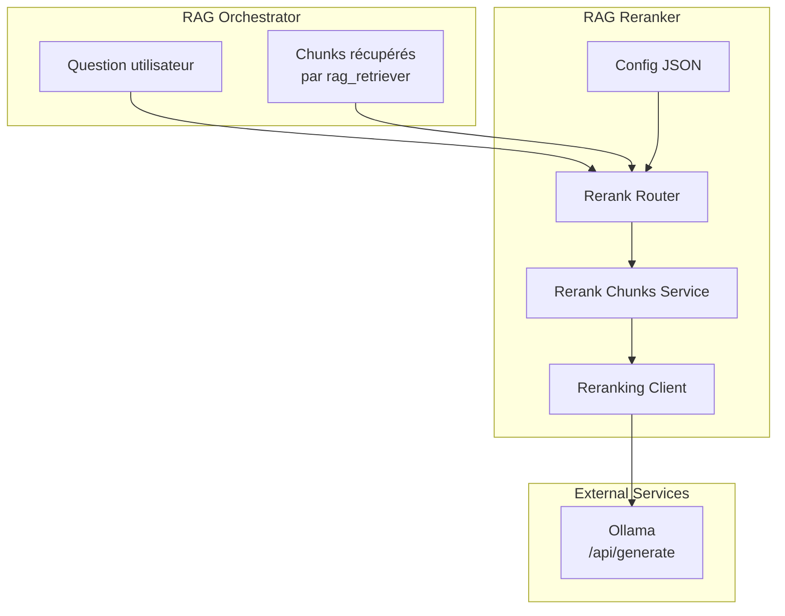
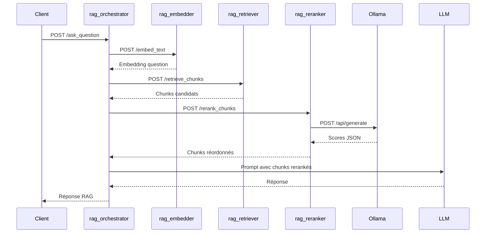

# Documentation du Micro-service RAG Reranker

## 1. Présentation Générale

### 1.1 Description

Le micro-service **rag_reranker** réordonne les chunks récupérés par le retriever avant leur utilisation par l'orchestrateur.

Il intervient après la recherche vectorielle et avant la construction du prompt envoyé au LLM. Son objectif est de garder les chunks les plus pertinents pour la question utilisateur.

### 1.2 Objectif

- **Recevoir une question et des chunks candidats** : l'orchestrateur transmet la question originale et les chunks du retriever.
- **Scorer les chunks** : le service interroge un modèle Ollama local.
- **Réordonner les chunks** : les résultats sont triés par score de reranking décroissant.
- **Limiter le contexte** : le paramètre `top_k` permet de ne conserver que les meilleurs chunks.

---

## 2. Architecture du Service



---

## 3. Structure du Projet

```
rag_reranker/
├── app/
│   ├── main.py                         # Point d'entrée FastAPI
│   ├── api/
│   │   ├── routers/
│   │   │   └── rerank_router.py         # Route API /rerank_chunks
│   │   ├── dependencies.py             # Dépendances FastAPI
│   │   └── lifespan.py                 # Chargement config au démarrage
│   ├── services/
│   │   └── rerank_chunks_service.py     # Tri et application du top_k
│   ├── dal/
│   │   └── clients/
│   │       └── reranking_client.py      # Client HTTP Ollama
│   ├── domain/models/
│   │   └── rerank_chunks_request_model.py
│   ├── schemas/
│   │   └── rerank_chunks_response_schema.py
│   └── core/
│       ├── config.py                   # Chargement configuration
│       ├── config.json                 # Configuration JSON
│       ├── exceptions.py               # Exceptions métier
│       ├── metrics.py                  # Métriques Prometheus
│       └── telemetry.py                # Traces OpenTelemetry
├── tests/
│   ├── unit_tests/
│   └── integration_tests/
├── docs/
│   └── index.md
├── dockerfile
├── dockerfile.docs
├── pyproject.toml
└── mkdocs.yml
```

---

## 4. Configuration

### 4.1 Fichier config.json

```json
{
    "reranking": {
        "provider": "ollama",
        "url": "http://ollama:11434/api/generate",
        "model": "qwen3:0.6b",
        "top_k": 8,
        "timeout_seconds": 180,
        "max_chunk_chars": 1600
    }
}
```

### 4.2 Paramètres de Configuration

| Paramètre | Description | Valeur par défaut |
|-----------|-------------|-------------------|
| `reranking.provider` | Fournisseur utilisé par le reranker | `ollama` |
| `reranking.url` | URL de l'API Ollama appelée par le service | `http://ollama:11434/api/generate` |
| `reranking.model` | Modèle Ollama local utilisé pour scorer les chunks | `qwen3:0.6b` |
| `reranking.top_k` | Nombre maximal de chunks renvoyés après reranking | `8` |
| `reranking.timeout_seconds` | Timeout HTTP de l'appel à Ollama | `180` secondes |
| `reranking.max_chunk_chars` | Nombre maximal de caractères transmis par chunk au modèle | `1600` |

Le modèle est volontairement configurable. Tu peux remplacer `qwen3:0.6b` par un modèle Ollama plus adapté au reranking si tu en ajoutes un localement.

---

## 5. API Endpoints

### 5.1 GET `/`

Vérification de l'état de l'API.

**Réponse :**

```json
{
    "status": "ok",
    "message": "API connection successful"
}
```

---

### 5.2 POST `/rerank_chunks`

Réordonne des chunks selon leur pertinence pour une question.

**Corps de la requête :**

```json
{
    "question": "Comment configurer Docker Compose ?",
    "chunks": [
        {
            "id": "Docker | docs/docker.md | 0",
            "document": "Docker Compose permet de déclarer plusieurs services...",
            "metadata": {
                "title": "Docker",
                "path": "docs/docker.md",
                "chunk_index": 0
            },
            "similarity": 0.82
        }
    ]
}
```

**Réponse :**

```json
{
    "duration_ms": 154.23,
    "duration_human": "00:00",
    "reranked_chunks": [
        {
            "id": "Docker | docs/docker.md | 0",
            "document": "Docker Compose permet de déclarer plusieurs services...",
            "metadata": {
                "title": "Docker",
                "path": "docs/docker.md",
                "chunk_index": 0
            },
            "similarity": 0.82,
            "rerank_score": 0.94
        }
    ]
}
```

---

## 6. Flux de Traitement

### 6.1 Question RAG avec Reranking



### 6.2 Endpoint MCP `/retrieve_chunks`

Le flux MCP passe aussi par le reranker :

```text
question -> embedder -> retriever -> reranker -> chunks renvoyés au MCP
```

Cela garantit que les chunks exposés à Kilo Code sont dans le même ordre que ceux utilisés pour construire le prompt RAG.

---

## 7. Services Détaillés

### 7.1 Rerank Chunks Service (`rerank_chunks_service.py`)

Responsabilités :

- retourner une liste vide si aucun chunk n'est fourni ;
- appeler le client de reranking ;
- ajouter `rerank_score` à chaque chunk ;
- trier par `rerank_score`, puis par `similarity` en cas d'égalité ;
- appliquer `top_k` depuis `config.json`.

### 7.2 Reranking Client (`reranking_client.py`)

Responsabilités :

- construire un prompt de scoring pour Ollama ;
- limiter la taille de chaque chunk avec `max_chunk_chars` ;
- appeler `reranking.url` avec `stream=false` et `format=json` ;
- parser la réponse JSON du modèle ;
- lever une exception métier si Ollama est indisponible ou si la réponse est invalide.

### 7.3 Exceptions Métier

| Exception | Slug | Code HTTP | Cas |
|-----------|------|-----------|-----|
| `RerankingServiceException` | `ERR_RERANKING_SERVICE` | `503` | Erreur réseau, timeout ou erreur HTTP Ollama |
| `RerankingResponseFormatException` | `ERR_RERANKING_RESPONSE_FORMAT` | `502` | Réponse Ollama non exploitable |

---

## 8. Logs, Métriques et Traces

### 8.1 Logs

Les logs sont écrits en JSON sur `stdout`, comme dans `rag_embedder`.

Champs utiles :

| Champ | Description |
|-------|-------------|
| `group` | Groupe fonctionnel, ici `reranking` |
| `event` | `request_started`, `request_completed`, `request_failed`, `business_exception` |
| `model` | Modèle Ollama utilisé |
| `chunk_count` | Nombre de chunks scorés |
| `duration_ms` | Durée de l'appel de reranking |
| `error_type` | Type d'erreur réseau ou applicative |

### 8.2 Métriques Prometheus

Le service expose `/metrics`.

| Métrique | Description |
|----------|-------------|
| `reranking_requests_total` | Nombre total de requêtes de reranking |
| `reranking_errors_total` | Nombre total d'erreurs de reranking |
| `reranking_duration_seconds` | Durée des requêtes de reranking |

### 8.3 Traces OpenTelemetry

Les traces sont envoyées vers Tempo avec `service.name=rag_reranker`.

---

## 9. Installation et Déploiement

### 9.1 Lancement avec Docker Compose

Depuis la racine du dépôt :

```bash
docker compose up --build rag_reranker
```

Le service est exposé sur :

| Port host | Port container | Usage |
|-----------|----------------|-------|
| `8006` | `8000` | API FastAPI |
| `5684` | `5678` | Debug Python |

### 9.2 Modèle Ollama

Docker Compose télécharge le modèle configuré par défaut :

```bash
ollama pull qwen3:0.6b
```

Si tu changes `reranking.model` dans `config.json`, ajoute aussi le `ollama pull <model>` correspondant dans `docker-compose.yml`.

---

## 10. Tests

Depuis `rag_reranker/` :

```bash
uv run pytest
uv run pytest tests/unit_tests
uv run pytest tests/integration_tests
uv run pytest --cov=app --cov-report=term-missing --cov-fail-under=80
```

Le test d'intégration Ollama est désactivé par défaut. Pour l'exécuter :

```bash
RAG_RERANKER_RUN_INTEGRATION=1 uv run pytest tests/integration_tests
```

---

## 11. Documentation MkDocs

Depuis `rag_reranker/` :

```bash
uv run mkdocs serve
uv run mkdocs build --strict
```

Avec Docker Compose, la documentation est exposée sur le port `8106`.

---

## 12. Bonnes Pratiques

- Garde `top_k` inférieur ou égal au nombre de chunks réellement utiles pour le prompt.
- Ajuste `max_chunk_chars` pour éviter des prompts de reranking trop longs.
- Surveille `reranking_duration_seconds` si tu augmentes `top_k` ou changes de modèle.
- Ne rends pas le retriever responsable du reranking : le retriever doit rester dédié à la recherche vectorielle.
- Si le modèle retourne souvent un JSON invalide, change de modèle ou simplifie le prompt de scoring.
