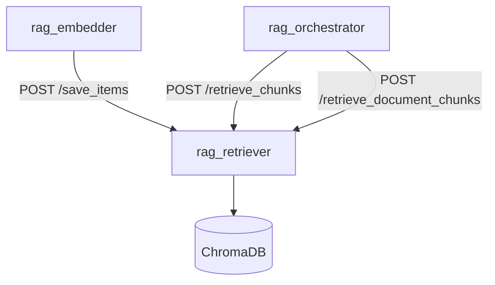
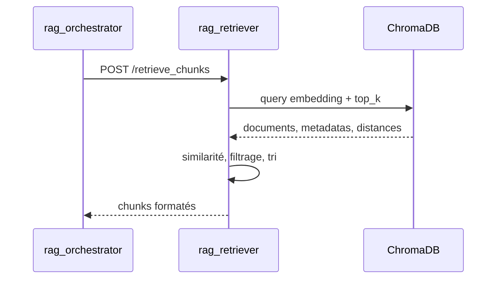

# Documentation du Micro-service RAG Retriever

## 1. Présentation Générale

`rag_retriever` lit et écrit les chunks vectorisés dans ChromaDB. Il reçoit les embeddings produits par `rag_embedder`, stocke les documents découpés, puis retourne les chunks les plus proches d'une question vectorisée.

## 2. Rôle dans l'architecture RAG



## 3. Structure du projet

| Dossier | Responsabilité |
|---|---|
| `app/api/routers` | Routes FastAPI de sauvegarde, recherche et suppression. |
| `app/services` | Orchestration métier du retrieval. |
| `app/dal/repositories` | Accès ChromaDB. |
| `app/core` | Configuration, exceptions, logs, métriques et traces. |
| `app/domain/models` | Modèles d'entrée métier. |
| `app/schemas` | Réponses API Pydantic. |

## 4. Configuration

| Paramètre | Description | Valeur actuelle |
|---|---|---|
| `retriever.top_k` | Nombre de chunks demandés à ChromaDB. | `20` |
| `retriever.minimum_similarity` | Seuil minimal de similarité conservé. | `0.4` |
| `retriever.minimum_number_of_chunks` | Nombre minimal de chunks retournés. | `1` |
| `retriever.max_related_links` | Nombre maximal de liens internes suivis. | `10` |
| `collection.name` | Collection ChromaDB utilisée. | `wiki_chunks` |

## 5. API Endpoints

| Méthode | Route | Rôle |
|---|---|---|
| `GET` | `/` | Healthcheck minimal. |
| `POST` | `/save_items` | Insère ou met à jour des items vectoriels. |
| `POST` | `/retrieve_chunks` | Retourne les chunks les plus proches d'un embedding. |
| `POST` | `/retrieve_document_chunks` | Retourne tous les chunks de documents donnés. |
| `POST` | `/delete_collection` | Réinitialise la collection configurée. |
| `GET` | `/metrics` | Métriques Prometheus. |

Exemple `POST /retrieve_chunks` :

```json
{
  "embeded_question": [0.1, 0.2, 0.3]
}
```

## 6. Flux de traitement



## 7. Observabilité et erreurs

Le service expose des logs JSON, des traces OpenTelemetry et `/metrics`.

| Signal | Description |
|---|---|
| `retriever_requests_total` | Requêtes par opération et statut. |
| `retriever_errors_total` | Erreurs par opération et type. |
| `retriever_duration_seconds` | Durée des routes métier. |
| `retriever_chroma_duration_seconds` | Durée des opérations ChromaDB. |
| `retriever_chunks_total` | Chunks lus ou écrits. |
| `retriever_collection_size` | Taille observée de la collection. |

Exceptions custom : `VectorStoreException`, `CollectionException`, `RetrievalFormatException`.

## 8. Docker Compose

Le service est exposé sur le port host `8001` et dépend de `chroma`.

```bash
docker compose up --build chroma rag_retriever
```

## 9. Documentation MkDocs

```bash
cd rag_retriever
uv run mkdocs serve
uv run mkdocs build --strict
```

## 10. Bonnes pratiques

- Ne pas mettre de texte de chunks dans les labels Prometheus.
- Ajuster `top_k` et `minimum_similarity` ensemble.
- Surveiller `retriever_chroma_duration_seconds` avant d'augmenter le volume documentaire.
